# Pipeline flows

Visual map of every reusable workflow — job names match what GitHub renders
in the Actions UI. Consumers only hold thin callers; all logic lives here.

## Who calls what (GitFlow)

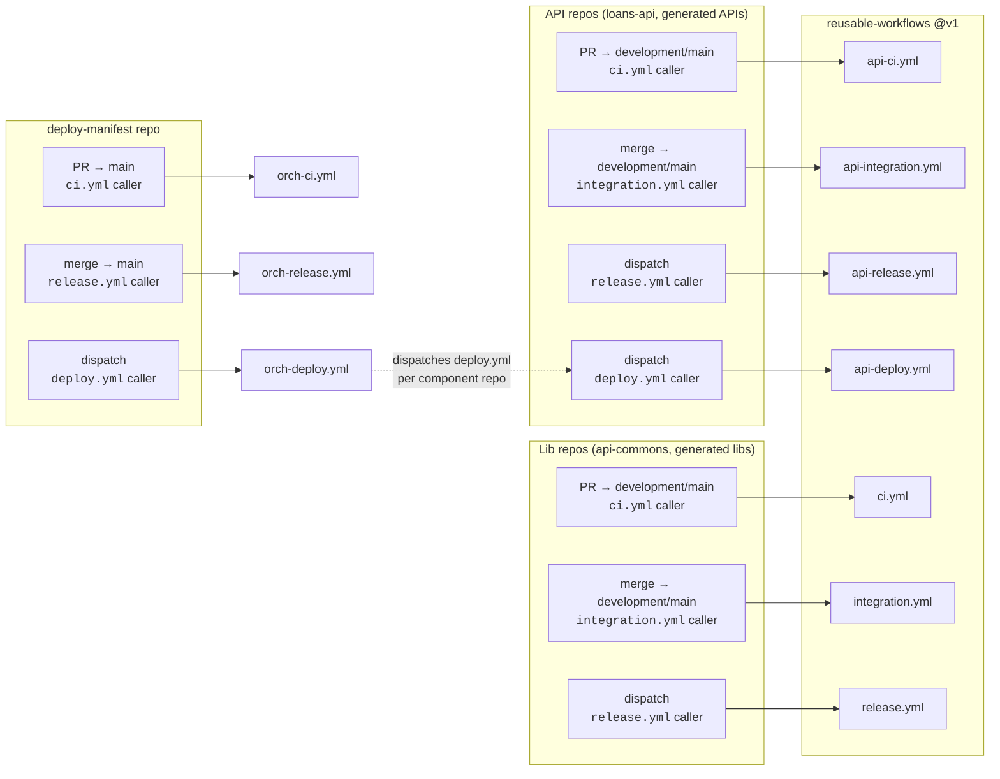

---

## API pipelines

### `api-ci.yml` — PR checks

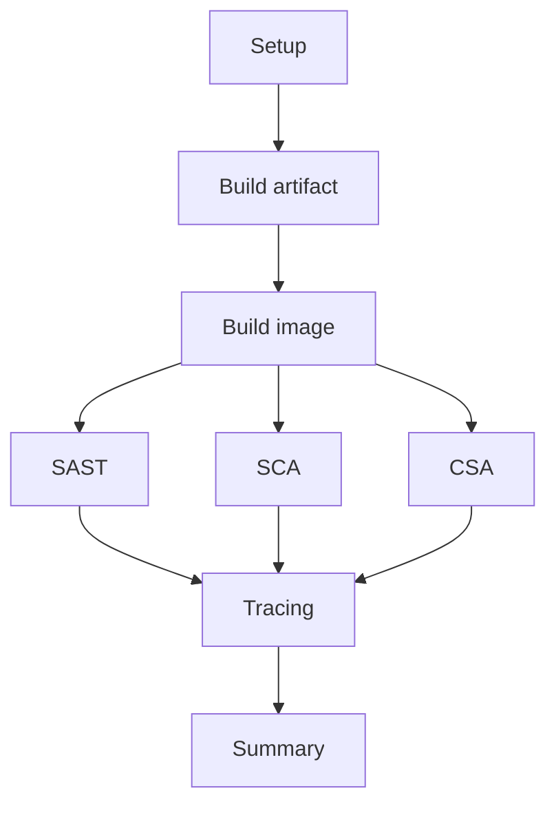

| Job | Does |
|---|---|
| Setup | Prints environment (JDK, Maven/Gradle, event, ref) |
| Build artifact | `./mvnw verify` → uploads `app-jar` + `test-reports` |
| Build image | `docker build` (self-contained Dockerfile) → uploads `image-tarball` |
| SAST | Semgrep over source → `semgrep-report` |
| SCA | Trivy **jar** scan (deps in `BOOT-INF/lib`) + secret scan over source |
| CSA | Trivy scan of the image tarball |
| Tracing | OTLP spans → Grafana Cloud (skipped if not configured) |
| Summary | Job matrix + findings recap in the run summary |

Nested callers can pass `final-report: false` → Tracing/Summary are skipped
inside the call and run once at the outer workflow level.

### `api-integration.yml` — merge to `development`/`main`

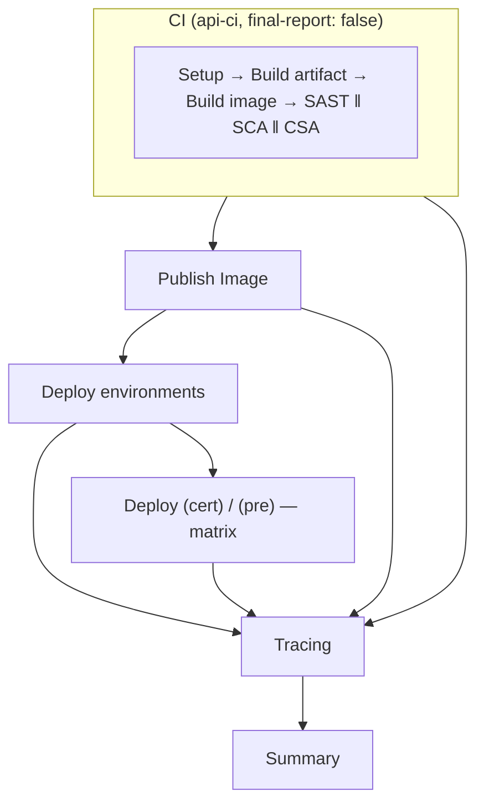

- **Publish Image** pushes to `docker.io/<DOCKER_USERNAME>/<repo>`:
  `:edge` + `:<sha>` on `development`, `:latest` + `:<sha>` on `main`.
- **Deploy environments** reads `vars.DEPLOY_ENVIRONMENTS` and emits the
  non-`pro` entries. **Deploy** is a matrix job over them — with the default
  `["pro"]` the matrix is empty and the job is skipped (prod never deploys
  on merge).
- Skipped when `VERCEL_PROJECT_ID` is not set.

### `api-release.yml` — manual dispatch

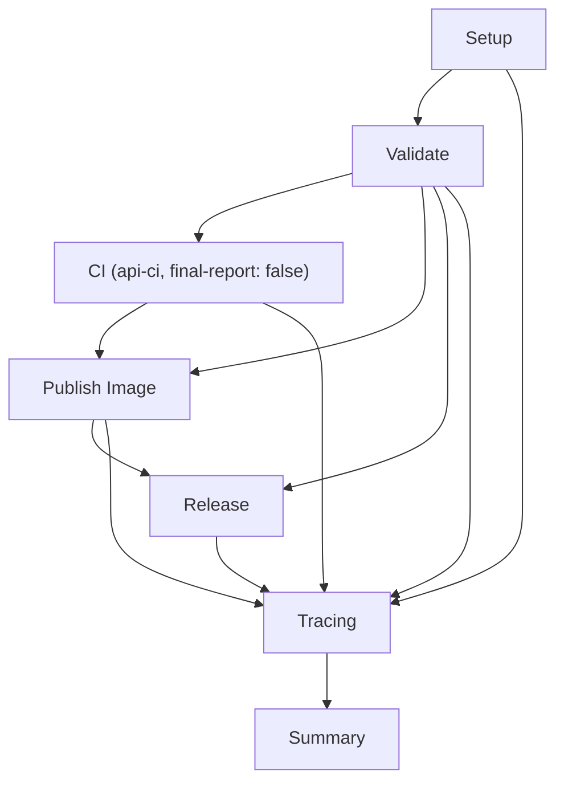

- **Validate**: semver, no SNAPSHOT, tag/release doesn't exist yet, version >
  latest release (`validate-release.py --kind api` — no Maven Central check).
- **Publish Image** pushes `:<version>` + `:latest`.
- **Release** creates the git tag + GitHub Release.
- **Never deploys** — production goes through `api-deploy.yml` (or the
  orchestrator) so it stays an explicit, auditable action.

### `api-deploy.yml` — manual dispatch (deploy a released version)

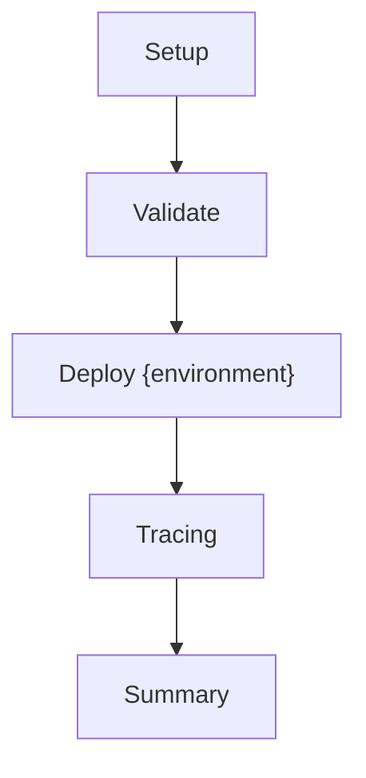

- Inputs: `version` (must match an existing tag + published image) and
  `environment` (`pro`/`cert`/`pre`, must be listed in
  `vars.DEPLOY_ENVIRONMENTS`).
- Deploys the already-published image to Vercel — `--prod` for `pro`,
  preview for the rest.

---

## Orchestrator pipelines (`deploy-manifest`)

### `orch-ci.yml` — PR on the manifest

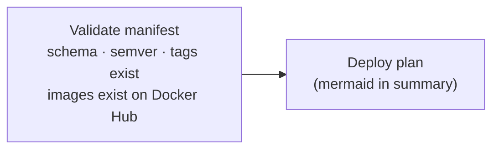

### `orch-release.yml` — merge to main

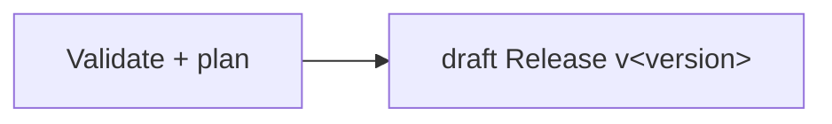

Publishing the draft is the approval gate — `orch-deploy` refuses drafts.

### `orch-deploy.yml` — manual dispatch `{version, environment}`

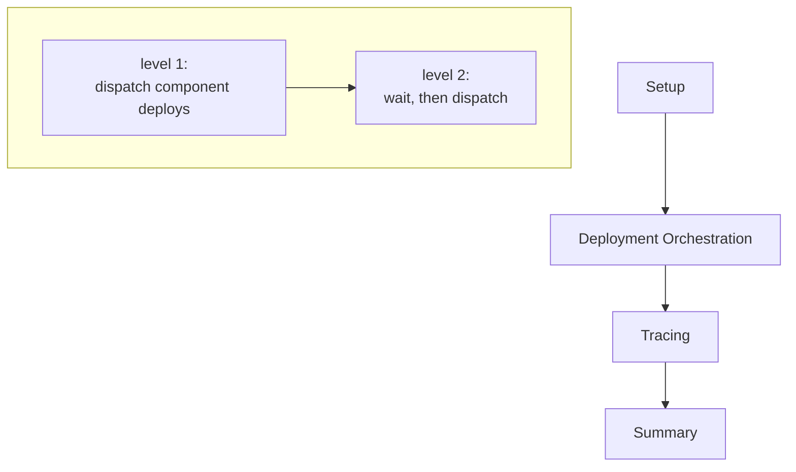

`topo-deploy.py deploy` checks out `manifest.yml` at the release tag,
Kahn-sorts components into levels, runs `gh workflow run deploy.yml` on each
component repo (`ORCHESTRATOR_TOKEN`, needs `actions:write`) and polls each
run to conclusion before starting the next level.

## Lib pipelines

### `ci.yml` — PR checks

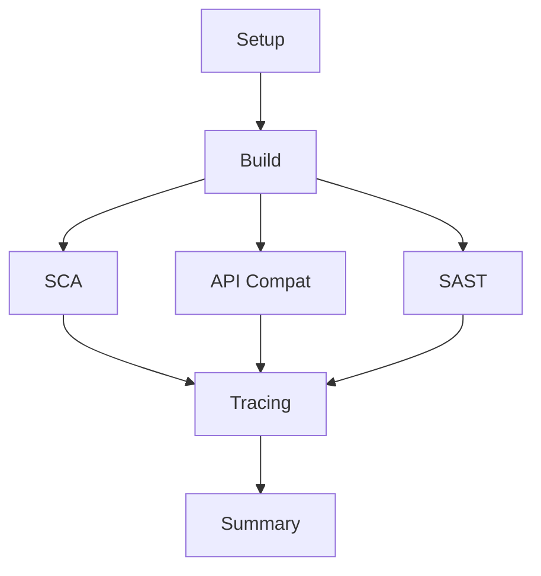

Build (`verify` + coverage) → SCA (Trivy fs) ‖ API Compat (japicmp vs latest
Central artifact) ‖ SAST (Semgrep) → Tracing → Summary.

### `integration.yml` — merge to `development`

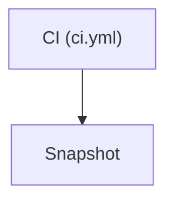

**Snapshot** publishes a `-SNAPSHOT` to Maven Central on every merge.

### `release.yml` — manual dispatch (from `main`)

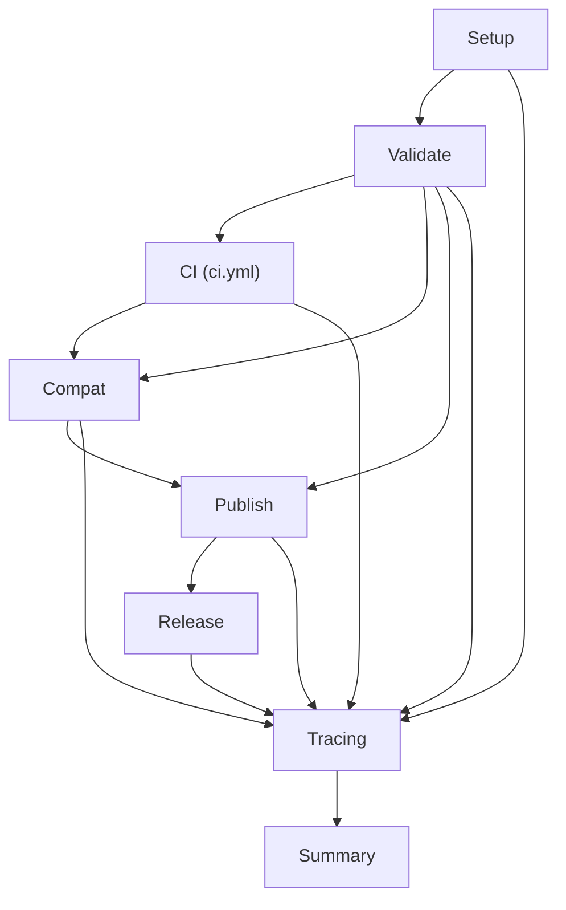

Validate (semver/tag exists/published check) → CI + Compat gate (japicmp
`--gate` fails on semver violations) → Publish to Maven Central (GPG-signed)
→ tag + GitHub Release → Tracing → Summary.

---

## Cross-cutting notes

- **Artifacts**: `app-jar`, `image-tarball`, `test-reports`, `semgrep-report`,
  `trivy-report`, `compat-report` — all uploaded per job, retained by GitHub
  defaults.
- **Tracing/Summary always run** (`if: always()`) so failures still emit
  spans and recap. Nested CI calls suppress their own via `final-report`.
- **Empty matrix = failure** on GitHub — that's why `api-integration`
  guards `deploy` with `envs != '[]'` and `api-deploy` takes a single env.
- Secrets never reach logs; `GRAFANA_OTLP_AUTH` only goes into the OTLP
  `Authorization` header.
